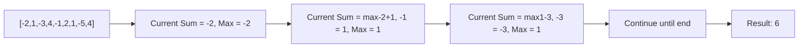
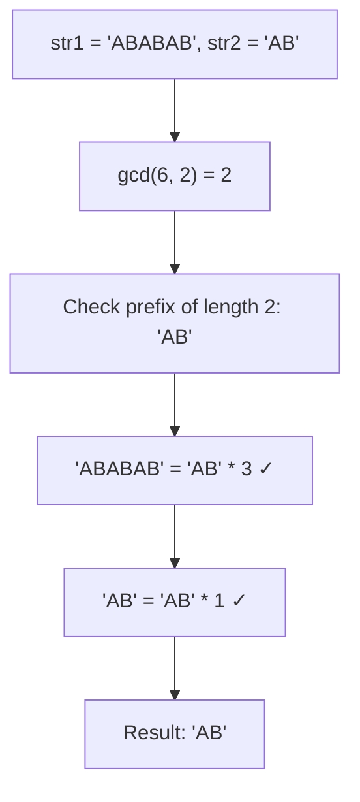
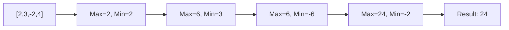
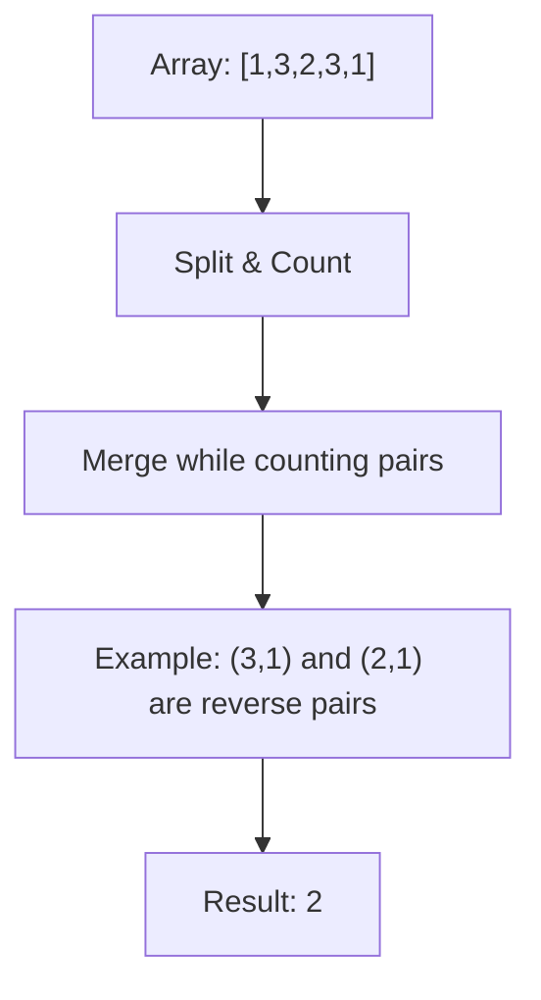
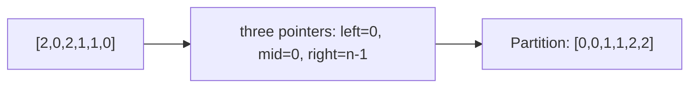
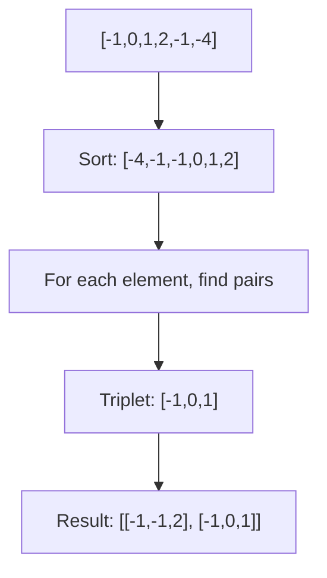

# Day 1: Array Problems

## Overview
This folder contains fundamental array algorithms covering subarrays, sorting, GCD, and searching problems.

## Problems

### 1. **Kadane's Algorithm** - Maximum Subarray Sum
**Description**: Find the contiguous subarray with the largest sum.

**Approach**: Track the current sum and maximum sum as you iterate through the array. Reset current sum to current element if it becomes negative.

**Time Complexity**: O(n) | **Space Complexity**: O(1)

---

### 2. **Find Missing and Repeating** - Array Manipulation
**Description**: Given an array of n integers where each number appears once except one appears twice and one is missing, find both numbers.

**Approach**: Use math (sum and product) or hash maps to identify the missing and repeating elements.

**Time Complexity**: O(n) | **Space Complexity**: O(1) or O(n)

---

### 3. **GCD of Strings**
**Description**: Find the greatest common divisor of two strings where a string divides another if it appears multiple times.

**Approach**: Calculate GCD of lengths, then check if both strings can be formed by repeating the prefix.

**Time Complexity**: O(n + m) | **Space Complexity**: O(1)

---

### 4. **Majority Element II** - Find All Elements > n/3
**Description**: Find all elements that appear more than n/3 times in an array.

**Approach**: Boyer-Moore Voting Algorithm modified for finding elements appearing more than n/3 times.

**Time Complexity**: O(n) | **Space Complexity**: O(1)

---

### 5. **Maximum Product Subarray**
**Description**: Find the contiguous subarray with the largest product.

**Approach**: Track both maximum and minimum products (due to negative numbers).

**Time Complexity**: O(n) | **Space Complexity**: O(1)

---

### 6. **Reverse Pairs** - Merge Sort Application
**Description**: Count pairs (i, j) where i < j and arr[i] > 2 * arr[j].

**Approach**: Use modified merge sort to count inversions while sorting.

**Time Complexity**: O(n log n) | **Space Complexity**: O(n)

---

### 7. **Sort Array of 0, 1, 2** - Dutch National Flag
**Description**: Sort array containing only 0s, 1s, and 2s in one pass.

**Approach**: Use three pointers to partition the array into three regions.

**Time Complexity**: O(n) | **Space Complexity**: O(1)

---

### 8. **3Sum** - Find All Triplets
**Description**: Find all unique triplets that sum to zero.

**Approach**: Sort array, then use two-pointer technique for each element.

**Time Complexity**: O(n²) | **Space Complexity**: O(1)
