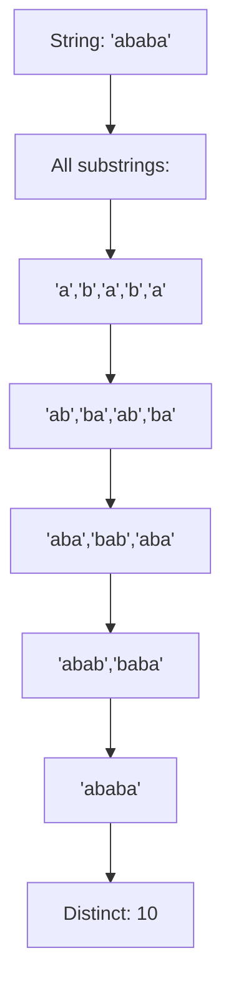
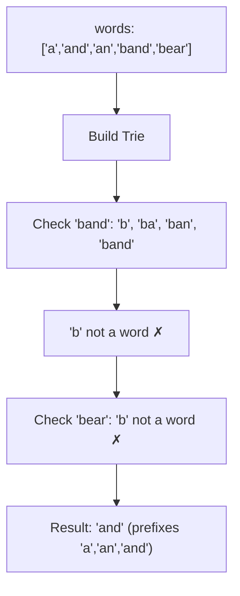
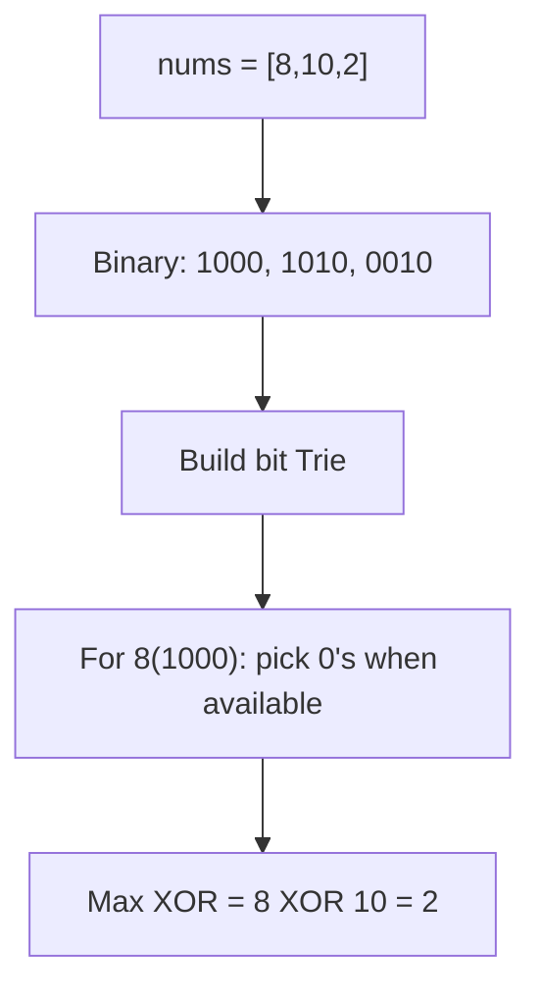
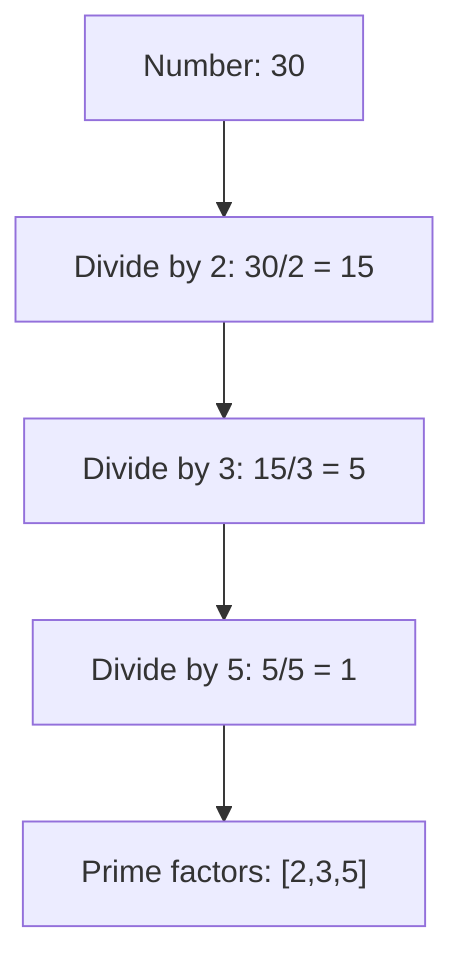
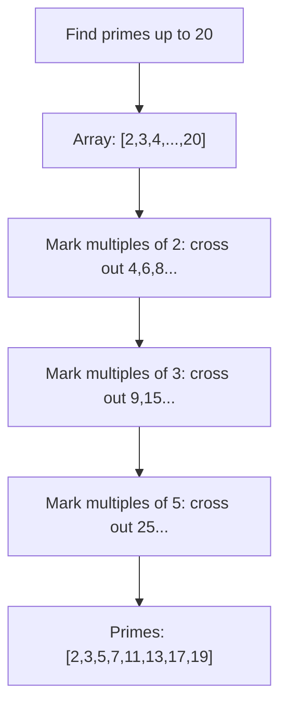
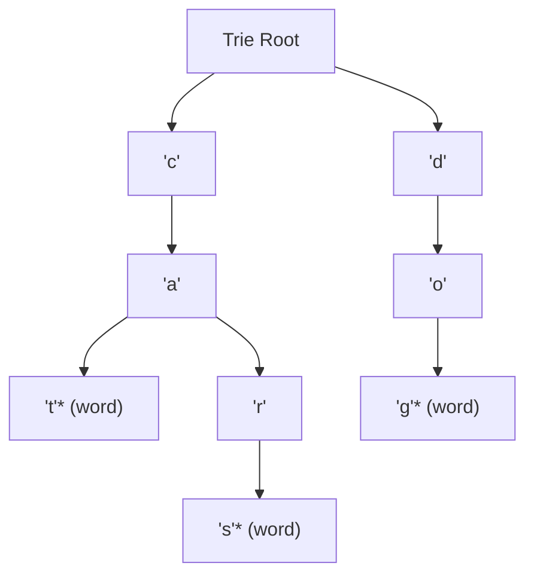
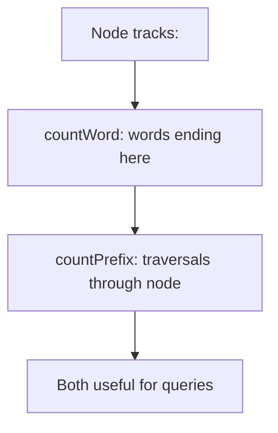

# Day 10: Advanced String & Trie Data Structures

## Overview
String manipulation, tries for efficient searching, and prime factorization.

## Problems

### 1. **Distinct Substrings** - String Analysis
**Description**: Count total number of distinct substrings of a string.

**Approach**: Use suffix array, suffix tree, or hash set to count unique substrings.

**Time Complexity**: O(n²) using hash set | **Space Complexity**: O(n²)

---

### 2. **Longest Complete String** - Trie Application
**Description**: Find longest string consisting of other strings as building blocks.

**Approach**: Use trie to track word prefixes, DFS from each word checking if all prefixes exist.

**Time Complexity**: O(n*m*26) where n=words, m=avg length | **Space Complexity**: O(n*m)

---

### 3. **Maximum XOR** - Trie Optimization
**Description**: Find maximum XOR of two numbers from array.

**Approach**: Build trie of binary representations, for each number greedily pick opposite bit at each level.

**Time Complexity**: O(n*32) = O(n) | **Space Complexity**: O(32*n) = O(n)

---

### 4. **Prime Factorization** - Number Theory
**Description**: Find prime factors of a number.

**Approach**: Iterate from 2, divide completely, continue with remaining number.

**Time Complexity**: O(√n) | **Space Complexity**: O(log n)

---

### 5. **Sieve of Eratosthenes** - Prime Generation
**Description**: Efficiently find all primes up to n.

**Approach**: Mark multiples of each prime as composite.

**Time Complexity**: O(n log log n) | **Space Complexity**: O(n)

---

### 6. **Trie Data Structure** - Core Implementation
**Description**: Efficient tree structure for storing and retrieving strings.

**Approach**: Each node has children map, terminal flag for word end.

Operations:
- **Insert**: Follow/create path, mark as word
- **Search**: Follow path, check if marked as word
- **StartsWith**: Follow path without needing word mark

**Time Complexity**: O(m) for m-length string | **Space Complexity**: O(n*26) where n=total chars

---

### 7. **Implement Trie II** - Advanced Operations
**Description**: Trie with additional operations like counting prefixes and words.

**Approach**: Store count of words and prefixes at each node.

**countWord** methods:
- Insert: increment word counts along path
- CountWordsEqualTo: return count at node
- CountWordsStartingWith: return prefix count at node

**Time Complexity**: O(m) per operation | **Space Complexity**: O(n*26)

**Key Differences from Trie I:**
- Track both word and prefix counts
- Enable efficient counting queries
- Support wildcard searches

---

## Summary

| Problem | Type | Key Technique |
|---------|------|--|
| Distinct Substrings | String | Hash Set |
| Longest Complete String | Trie | DFS on Trie |
| Maximum XOR | Trie | Bit Trie Greedy |
| Prime Factorization | Math | Trial Division |
| Sieve of Eratosthenes | Math | Marking Multiples |
| Trie | Data Structure | Prefix Tree |
