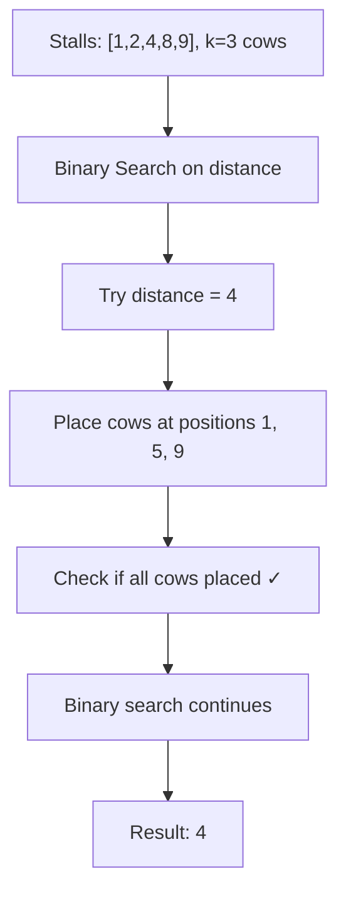
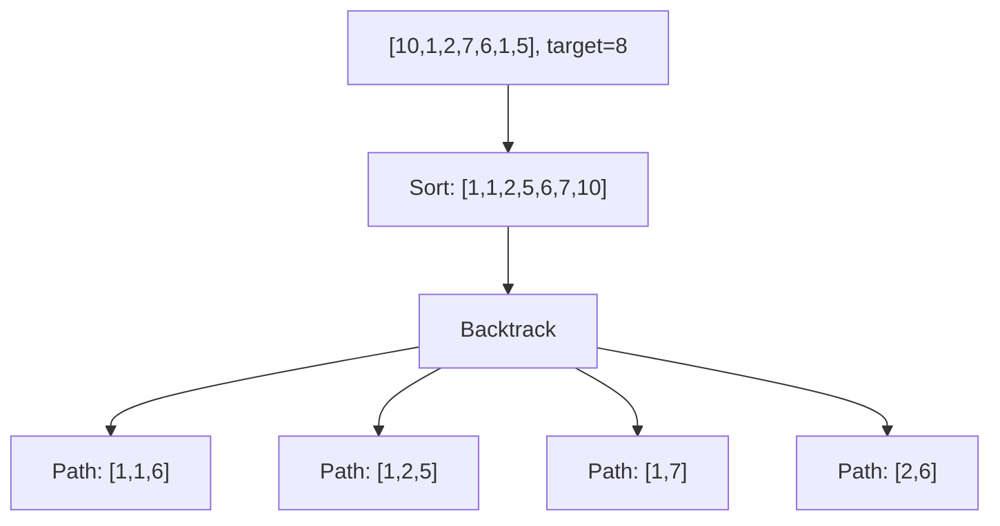
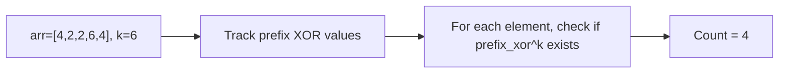
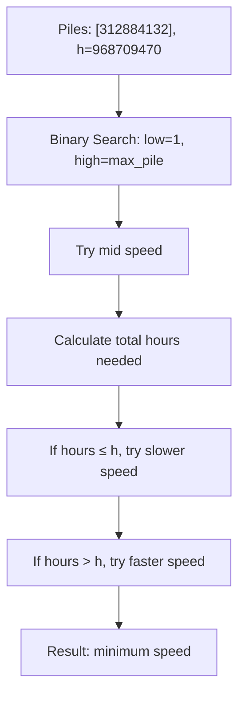
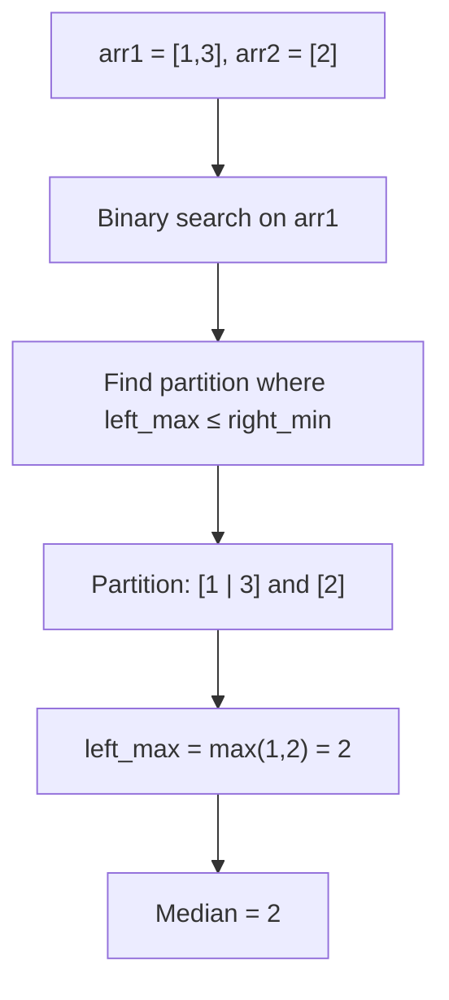
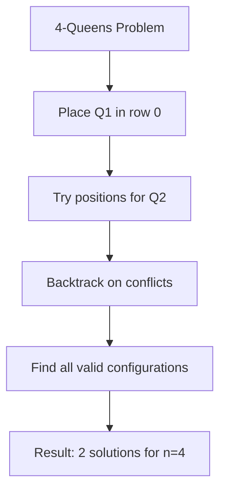
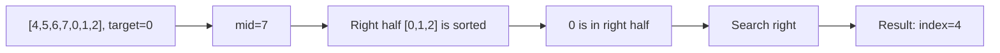

# Day 2: Binary Search & Dynamic Programming

## Overview
Advanced search techniques and optimization problems using binary search and backtracking.

## Problems

### 1. **Aggressive Cows** - Binary Search Application
**Description**: Place k cows in n stalls such that minimum distance between any two cows is maximized.

**Approach**: Binary search on the answer (distance). For each distance, check if we can place all cows.

**Time Complexity**: O(n log n + n log(max_distance)) | **Space Complexity**: O(1)

---

### 2. **Combination Sum II**
**Description**: Find all unique combinations that sum to target, each element used once.

**Approach**: Backtracking with sorting to avoid duplicates.

**Time Complexity**: O(2^n) | **Space Complexity**: O(n)

---

### 3. **Count Subarray with Given XOR**
**Description**: Count subarrays with XOR equal to k.

**Approach**: Use prefix XOR with hash map. If prefix_xor ^ k exists, it forms a valid subarray.

**Time Complexity**: O(n) | **Space Complexity**: O(n)

---

### 4. **Koko Eating Bananas** - Binary Search on Answer
**Description**: Find minimum eating speed for Koko to finish all piles within h hours.

**Approach**: Binary search on the eating speed and verify if Koko can finish within time limit.

**Time Complexity**: O(n log(max_pile)) | **Space Complexity**: O(1)

---

### 5. **Median of Two Sorted Arrays** - Hard Problem
**Description**: Find median of two sorted arrays.

**Approach**: Binary search on smaller array to partition both arrays correctly.

**Time Complexity**: O(log(min(m,n))) | **Space Complexity**: O(1)

---

### 6. **N-Queens Problem** - Backtracking
**Description**: Place n queens on n×n chessboard so no two queens attack each other.

**Approach**: Backtracking with constraint checking (no same row, column, or diagonal).

**Time Complexity**: O(N!) | **Space Complexity**: O(N)

---

### 7. **Search in Rotated Sorted Array**
**Description**: Find target in a rotated sorted array with O(log n) complexity.

**Approach**: Binary search identifying which half is properly sorted, then search accordingly.

**Time Complexity**: O(log n) | **Space Complexity**: O(1)
