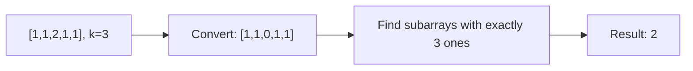
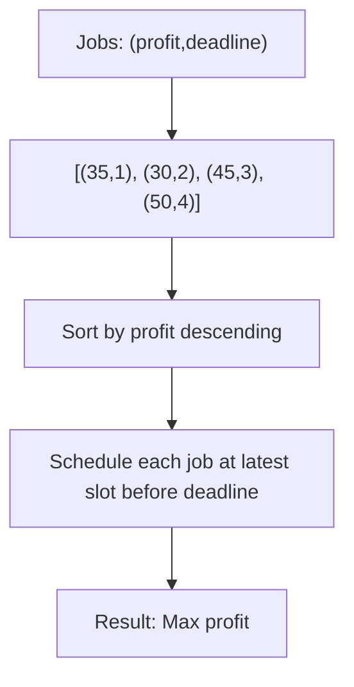
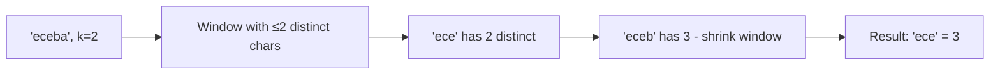
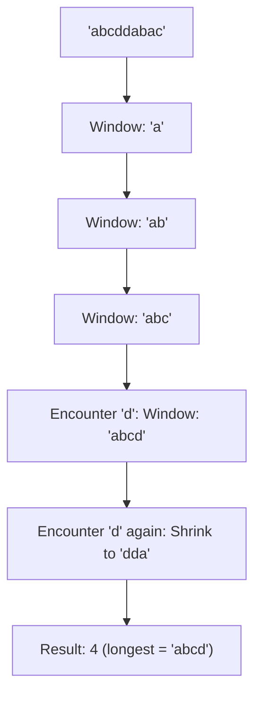
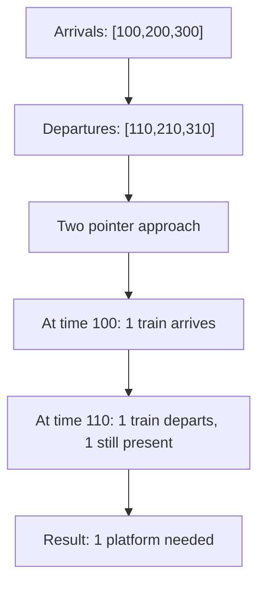
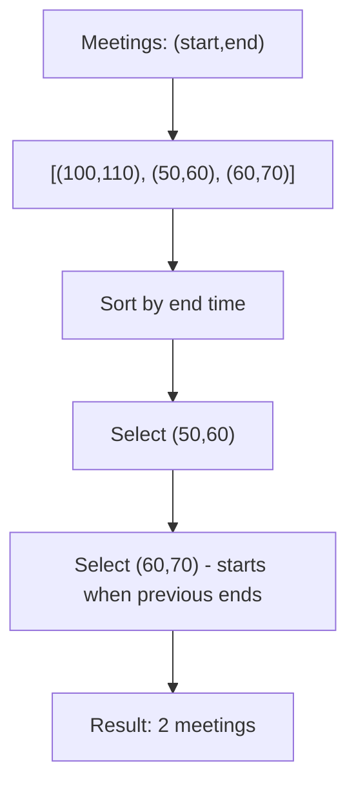
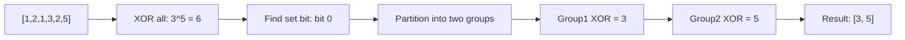

# Day 3: Sliding Window & Greedy Algorithms

## Overview
Efficient techniques for substring/subarray problems and scheduling algorithms.

## Problems

### 1. **Count Number of Nice Subarrays** - Sliding Window
**Description**: Count subarrays with exactly k odd numbers.

**Approach**: Convert problem to counting subarrays with exactly k 1s (odd=1, even=0). Use sliding window with two-pointer technique.

**Time Complexity**: O(n) | **Space Complexity**: O(1)

---

### 2. **Job Sequencing with Deadlines**
**Description**: Maximize profit by scheduling jobs with deadlines.

**Approach**: Greedy - sort by profit (descending), schedule each job at its latest possible time before deadline.

**Time Complexity**: O(n² + n log n) | **Space Complexity**: O(n)

---

### 3. **Longest Substring with At Most K Distinct Characters**
**Description**: Find longest substring containing at most k distinct characters.

**Approach**: Sliding window with hash map tracking character frequencies.

**Time Complexity**: O(n) | **Space Complexity**: O(k)

---

### 4. **Longest Substring Without Repeating Characters** - Sliding Window
**Description**: Find length of longest substring without repeating characters.

**Approach**: Use sliding window with character map to track last seen position. Move left pointer when character repeats.

**Time Complexity**: O(n) | **Space Complexity**: O(min(n, charset_size))

---

### 5. **Minimum Platforms Needed** - Greedy/Sorting
**Description**: Minimum platforms needed for trains arriving and departing at given times.

**Approach**: Sort arrivals and departures separately, use two pointers to find maximum concurrent trains.

**Time Complexity**: O(n log n) | **Space Complexity**: O(1)

---

### 6. **N Meetings in One Room** - Greedy
**Description**: Select maximum non-overlapping meetings.

**Approach**: Greedy - sort by end time, select meetings that start after current end time.

**Time Complexity**: O(n log n) | **Space Complexity**: O(1)

---

### 7. **Single Number III** - Bit Manipulation
**Description**: Find two numbers appearing once in array where all others appear twice.

**Approach**: XOR all numbers to get a^b, find rightmost set bit to partition numbers, XOR each partition separately.

**Time Complexity**: O(n) | **Space Complexity**: O(1)
