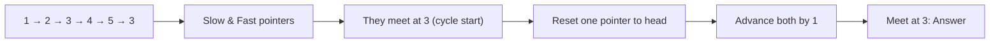
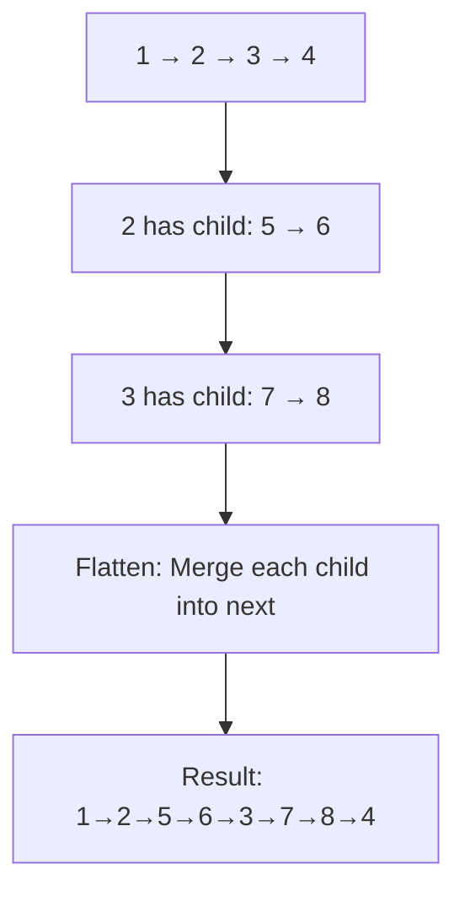
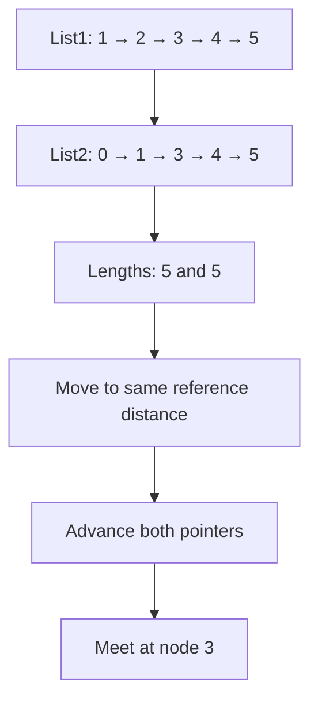
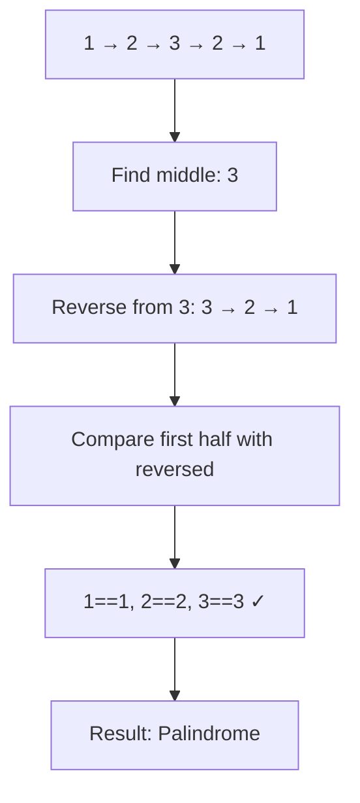
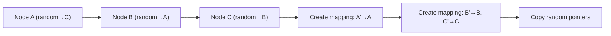
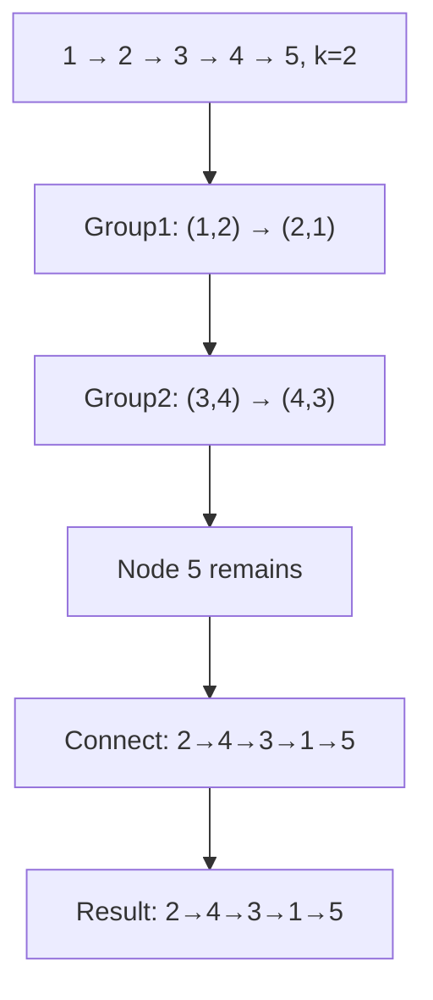
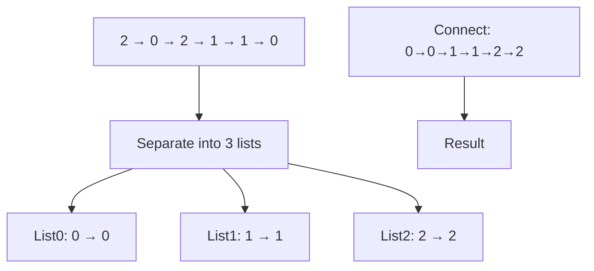

# Day 4: Linked List Problems

## Overview
Comprehensive linked list manipulation including flattening, reversal, cycle detection, and pointer operations.

## Problems

### 1. **Find Starting Point of Cycle in Linked List**
**Description**: Detect if cycle exists and find the node where cycle begins.

**Approach**: Floyd's Cycle Detection Algorithm - use slow and fast pointers. When they meet, move one to head and advance both by 1 until they meet again.

**Time Complexity**: O(n) | **Space Complexity**: O(1)

---

### 2. **Flattening a Multilevel Linked List** - Complex Problem
**Description**: Flatten multilevel linked list where each node has 'next' and 'child' pointers.

**Approach**: Use recursion or stack-based approach. Merge child list into next, continue flattening.

**Time Complexity**: O(n) where n = total nodes | **Space Complexity**: O(1)

---

### 3. **Intersection Point of Two Linked Lists**
**Description**: Find node where two linked lists intersect.

**Approach**: Get lengths, move pointer of longer list by difference, then advance both until they meet.

**Time Complexity**: O(m + n) | **Space Complexity**: O(1)

---

### 4. **Check if Linked List is Palindrome**
**Description**: Determine if linked list is palindrome.

**Approach**: Find middle using slow/fast pointers, reverse second half, compare both halves.

**Time Complexity**: O(n) | **Space Complexity**: O(1)

---

### 5. **Random Pointer Linked List** - Deep Copy
**Description**: Create deep copy of linked list with random pointers.

**Approach**: Use hash map to store mapping of original nodes to copied nodes, handle random pointers in second pass.

**Time Complexity**: O(n) | **Space Complexity**: O(n)

---

### 6. **Reverse K Group** - Complex Reversal
**Description**: Reverse nodes of linked list k at a time.

**Approach**: Group nodes in k, reverse each group, connect groups together.

**Time Complexity**: O(n) | **Space Complexity**: O(1)

---

### 7. **Sort Linked List of 0, 1, 2** - Partitioning
**Description**: Sort linked list containing only 0s, 1s, and 2s.

**Approach**: Create three separate lists for 0s, 1s, 2s, then concatenate them.

**Time Complexity**: O(n) | **Space Complexity**: O(1)
