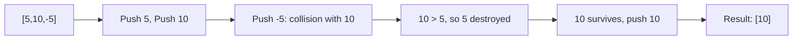
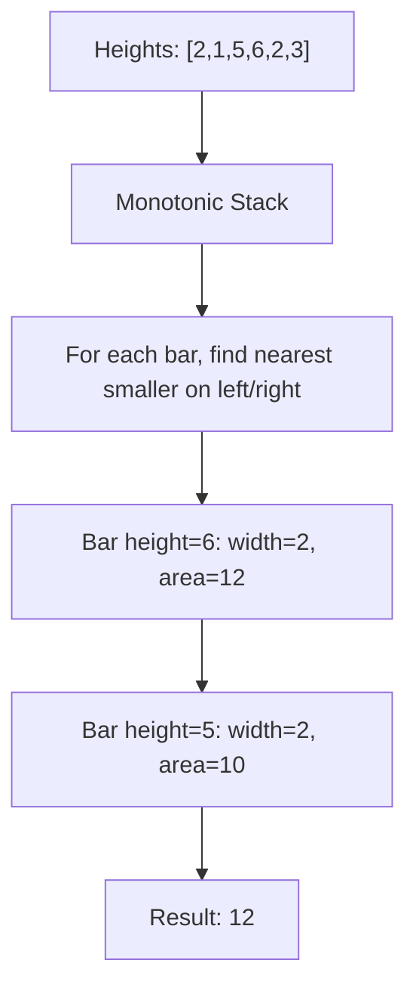
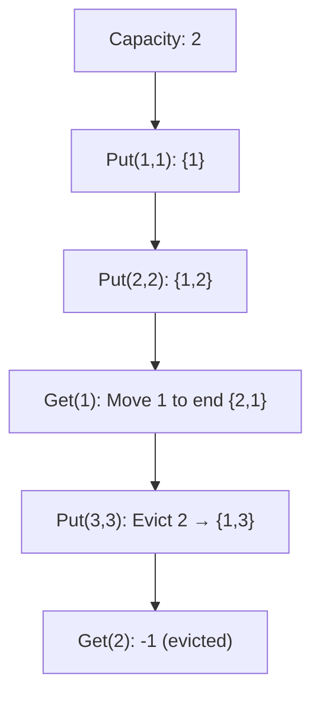
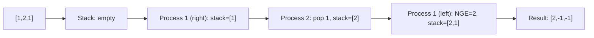
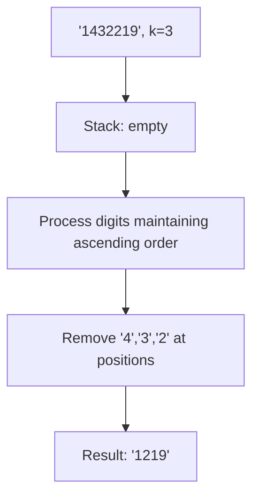
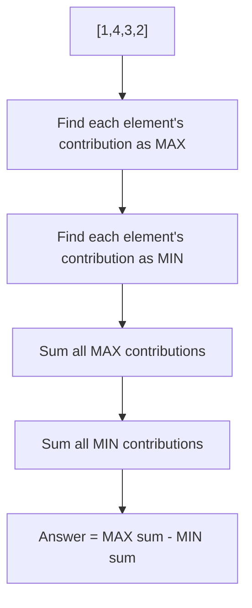
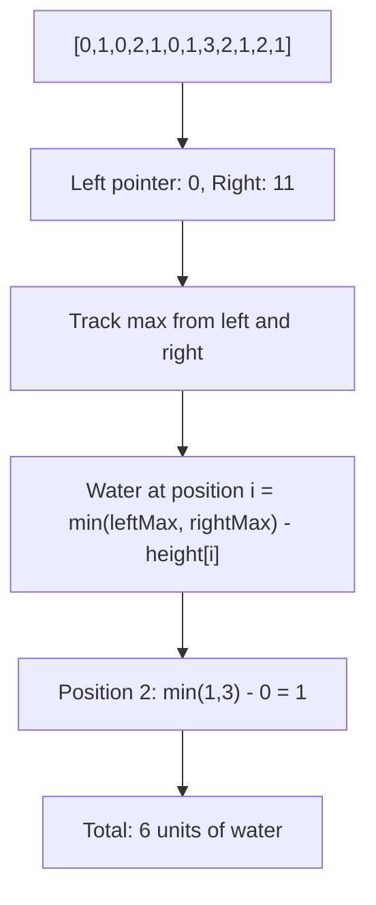

# Day 5: Stack & Monotonic Structures

## Overview
Stack-based algorithms, monotonic deques/stacks, and dynamic programming on stack problems.

## Problems

### 1. **Asteroid Collision** - Stack Simulation
**Description**: Simulate asteroid collisions and return final state.

**Approach**: Use stack to track asteroids, check collision rules (left-moving hits right-moving).

**Time Complexity**: O(n) | **Space Complexity**: O(n)

---

### 2. **Largest Rectangle in Histogram** - Monotonic Stack
**Description**: Find largest rectangle area in histogram.

**Approach**: Use monotonic stack to efficiently find left and right boundaries for each bar.

**Time Complexity**: O(n) | **Space Complexity**: O(n)

---

### 3. **LRU Cache** - Design Problem
**Description**: Implement LRU cache with O(1) get and put operations.

**Approach**: Use doubly-linked list + hash map for O(1) operations.

**Time Complexity**: O(1) for get/put | **Space Complexity**: O(capacity)

---

### 4. **Next Greater Element** - Monotonic Stack
**Description**: For each element, find next greater element.

**Approach**: Traverse from right to left with monotonic decreasing stack.

**Time Complexity**: O(n) | **Space Complexity**: O(n)

---

### 5. **Remove K Digits** - Greedy Stack
**Description**: Remove k digits to get smallest number.

**Approach**: Use stack, remove larger digits when smaller digit comes. Maintain order.

**Time Complexity**: O(n) | **Space Complexity**: O(n)

---

### 6. **Sum of Subarray Ranges** - Complex
**Description**: Sum of (max - min) for all subarrays.

**Approach**: Use monotonic stacks to find contribution of each element as max/min across all subarrays.

**Time Complexity**: O(n) | **Space Complexity**: O(n)

---

### 7. **Trapping Rain Water** - Two Pointer Technique
**Description**: Calculate trapped rainwater between elevation map heights.

**Approach**: Track left/right maximums from both ends, move pointer with smaller max.

**Time Complexity**: O(n) | **Space Complexity**: O(1)
