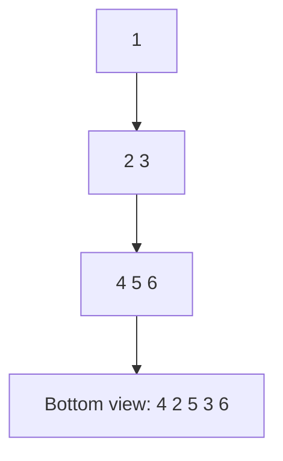
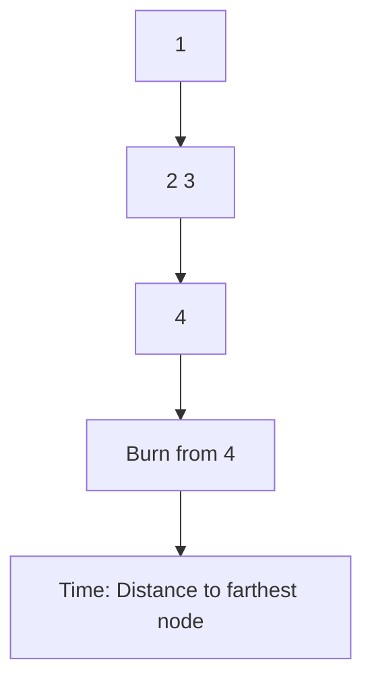
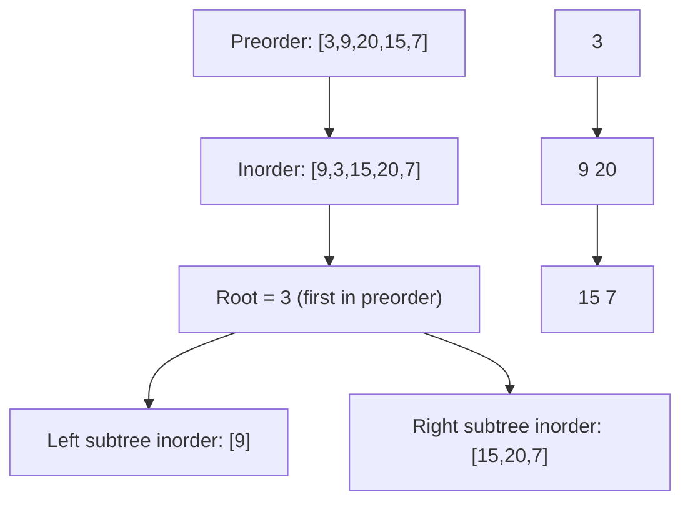
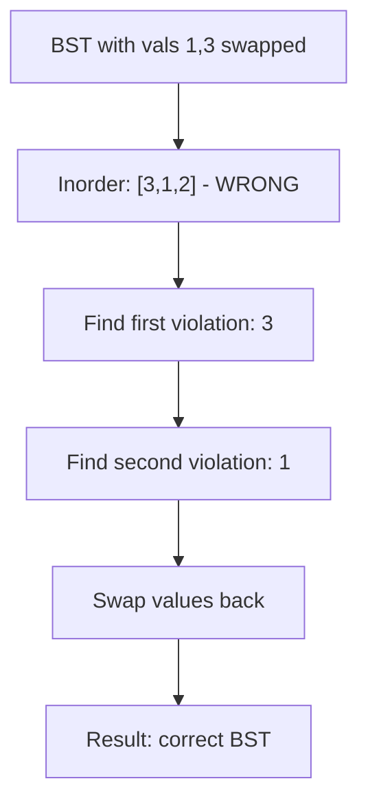
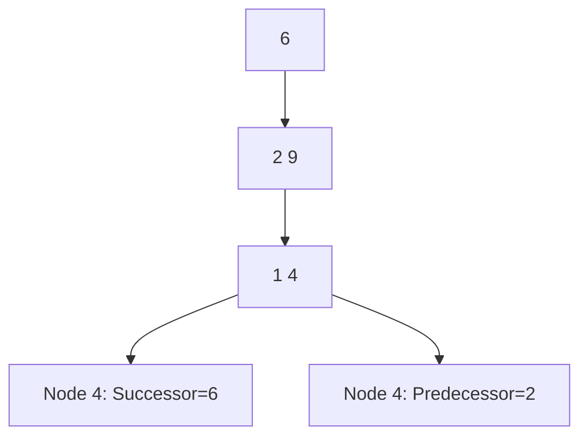
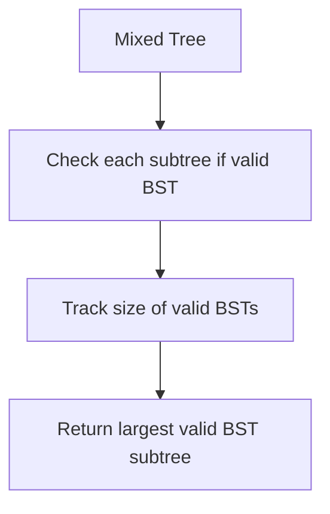
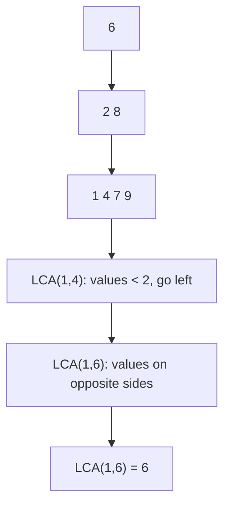
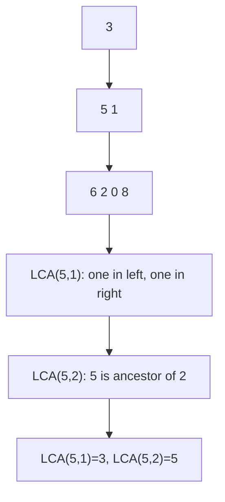
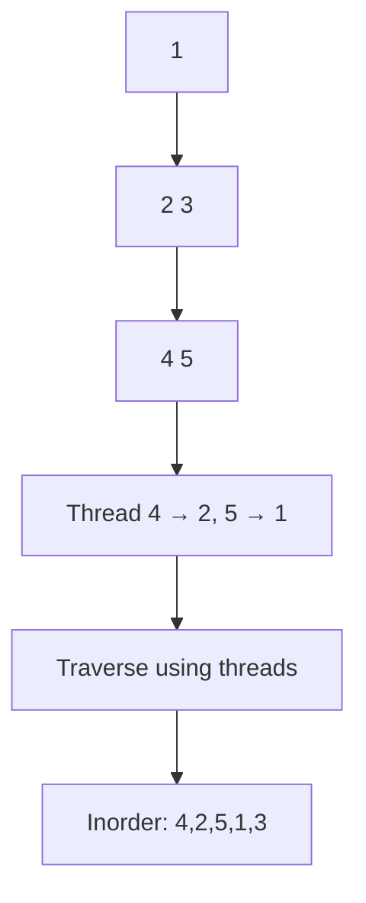
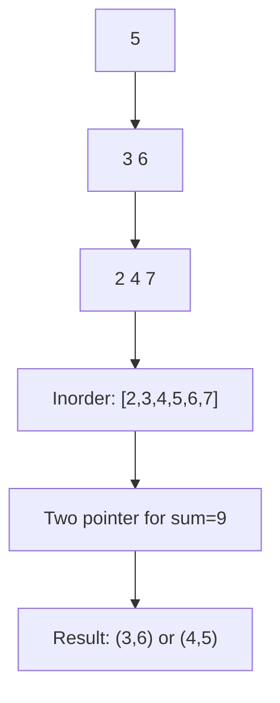

# Day 6: Binary Trees

## Overview
Comprehensive tree traversals, tree construction, path problems, and BST operations.

## Problems

### 1. **Bottom View of Binary Tree** - Tree Traversal
**Description**: Get nodes visible from bottom when looking at tree from below.

**Approach**: Level order traversal with horizontal distance tracking. Keep last node at each distance.

**Time Complexity**: O(n) | **Space Complexity**: O(n)

---

### 2. **Burn Tree from Leaf** - Path Finding
**Description**: Find time to burn entire tree starting from a leaf node.

**Approach**: Find target leaf, track parent pointers, BFS/DFS from target treating edges as burnable in all directions.

**Time Complexity**: O(n) | **Space Complexity**: O(n)

---

### 3. **Construct Binary Tree from Preorder and Inorder** - Tree Construction
**Description**: Build binary tree from preorder and inorder traversal arrays.

**Approach**: Preorder gives root, inorder tells left/right subtrees. Use recursion with index mapping.

**Time Complexity**: O(n) | **Space Complexity**: O(n)

---

### 4. **Correct BST from Swapped Nodes** - BST Repair
**Description**: Fix BST where two values were swapped.

**Approach**: Inorder traversal finds violations, identify swapped nodes, swap values back.

**Time Complexity**: O(n) | **Space Complexity**: O(h)

---

### 5. **Inorder Successor/Predecessor in BST** - BST Navigation
**Description**: Find inorder successor or predecessor of a node in BST.

**Approach**: 
- Successor: Go right once, then left as far as possible
- Predecessor: Go left once, then right as far as possible

**Time Complexity**: O(h) | **Space Complexity**: O(1)

---

### 6. **Largest BST in Binary Tree** - Complex DP
**Description**: Find largest binary search subtree in binary tree.

**Approach**: Use DFS returning (is_bst, size, min_val, max_val) for each subtree.

**Time Complexity**: O(n) | **Space Complexity**: O(h)

---

### 7. **LCA in BST** - Binary Search Tree Property
**Description**: Find lowest common ancestor in BST.

**Approach**: Use BST property - if both nodes are in different subtrees, current node is LCA.

**Time Complexity**: O(h) | **Space Complexity**: O(1)

---

### 8. **LCA in Binary Tree** - General Tree
**Description**: Find lowest common ancestor in general binary tree.

**Approach**: Use recursion - LCA is node where both p and q are in different subtrees or node itself is p or q.

**Time Complexity**: O(n) | **Space Complexity**: O(h)

---

### 9. **Morris Inorder Traversal** - Advanced Traversal
**Description**: Inorder traversal without recursion or explicit stack using threaded tree.

**Approach**: Create temporary links (threads) to successor nodes.

**Time Complexity**: O(n) | **Space Complexity**: O(1)

---

### 10. **Two Sum in BST** - Pair Finding
**Description**: Find two nodes with sum equal to target in BST.

**Approach**: Use inorder traversal to get sorted array, then two-pointer technique.

**Time Complexity**: O(n) | **Space Complexity**: O(h)
