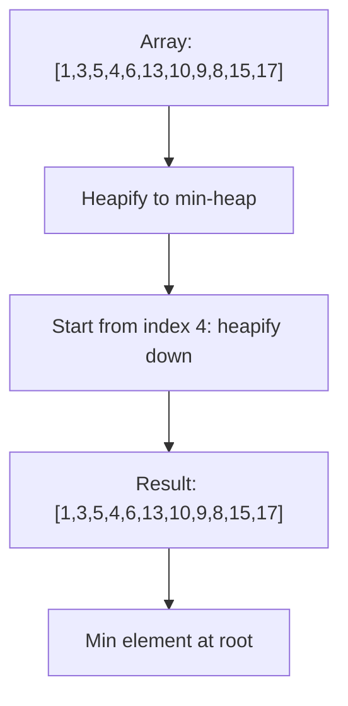
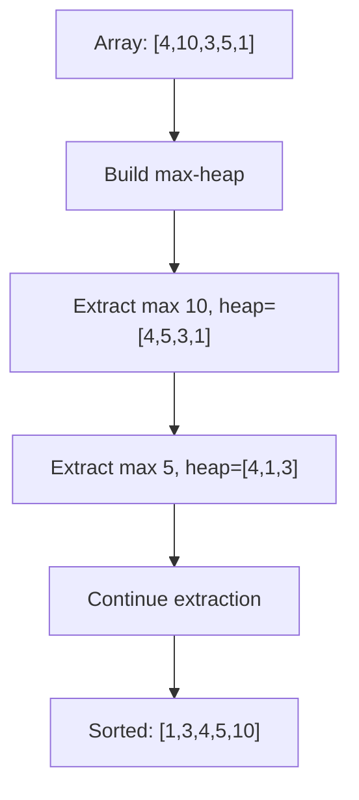
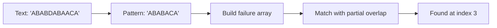
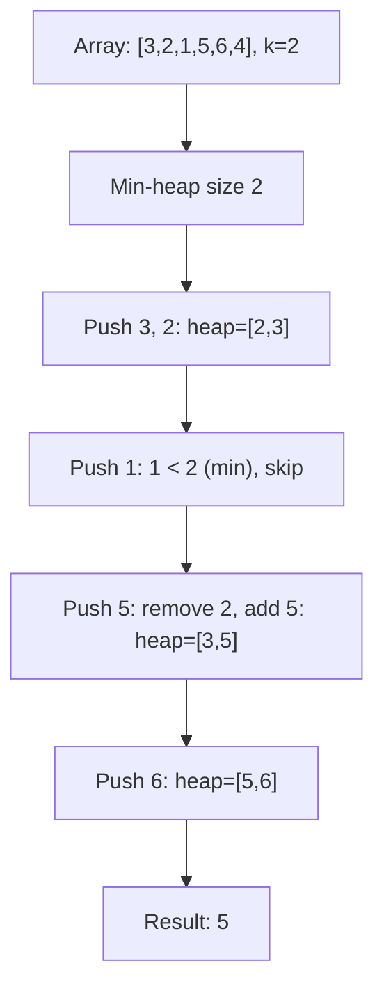
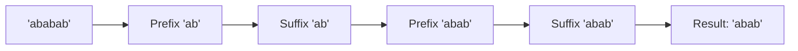
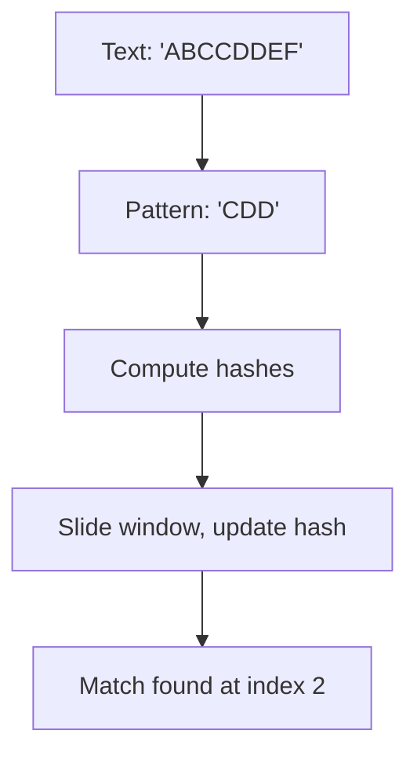
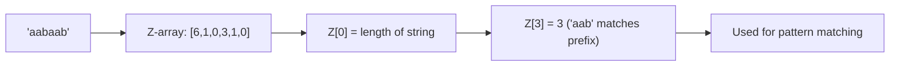

# Day 7: String Algorithms & Heaps

## Overview
String pattern matching, prime factorization, and heap operations.

## Problems

### 1. **Heapify** - Heap Construction
**Description**: Convert array into min or max heap structure.

**Approach**: Start from last non-leaf node, heapify down to maintain heap property.

**Time Complexity**: O(n) | **Space Complexity**: O(1)

---

### 2. **Heap Sort** - Sorting via Heap
**Description**: Sort array using heap data structure.

**Approach**: Build max heap, repeatedly extract max element and place at end.

**Time Complexity**: O(n log n) | **Space Complexity**: O(1)

---

### 3. **KMP Algorithm** - String Matching
**Description**: Find pattern in text efficiently using KMP (Knuth-Morris-Pratt).

**Approach**: Build failure function to avoid redundant comparisons on mismatch.

**Time Complexity**: O(n + m) | **Space Complexity**: O(m)

---

### 4. **Kth Largest Element** - Heap Application
**Description**: Find kth largest element in array.

**Approach**: Use min-heap of size k to track k largest elements.

**Time Complexity**: O(n log k) | **Space Complexity**: O(k)

---

### 5. **Longest Happy Prefix** - KMP Variant
**Description**: Find longest prefix that is also a suffix (no overlap).

**Approach**: Use KMP failure function to find longest proper prefix-suffix.

**Time Complexity**: O(n) | **Space Complexity**: O(n)

---

### 6. **Rabin-Karp Algorithm** - String Matching
**Description**: Find pattern using rolling hash for efficient comparison.

**Approach**: Compute hash of pattern and text window, compare hashes, verify on match.

**Time Complexity**: O(n + m) average | **Space Complexity**: O(1)

---

### 7. **Z-Function Algorithm** - String Processing
**Description**: Compute Z-array where Z[i] = length of substring starting at i matching prefix.

**Approach**: Maintain window [l, r] of maximum Z-value found so far.

**Time Complexity**: O(n) | **Space Complexity**: O(n)
