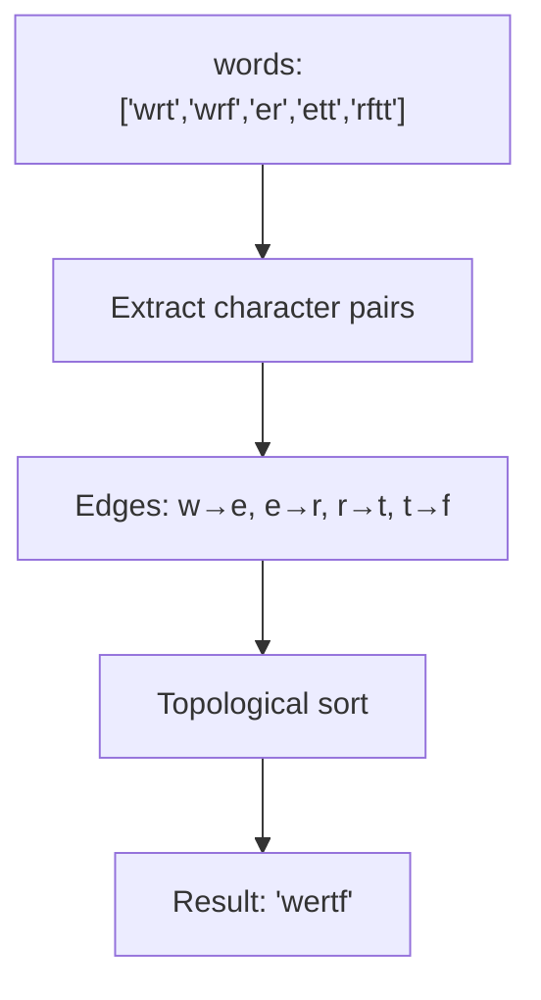
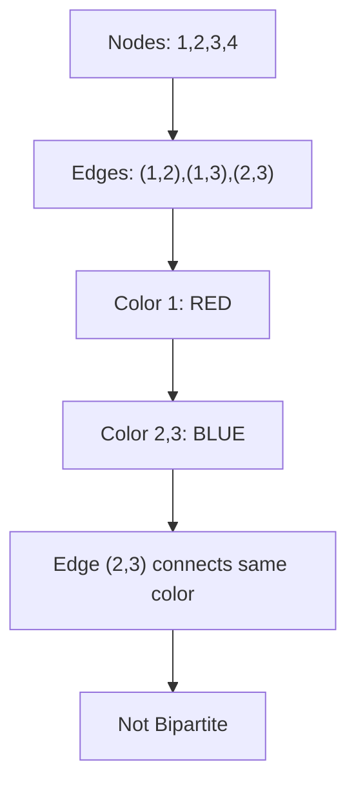
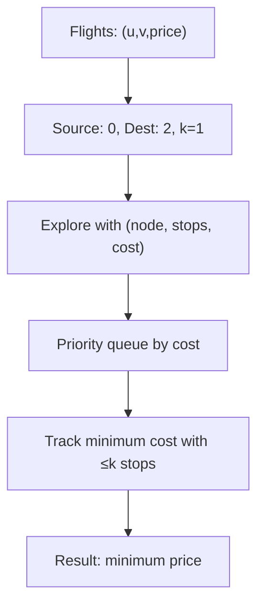
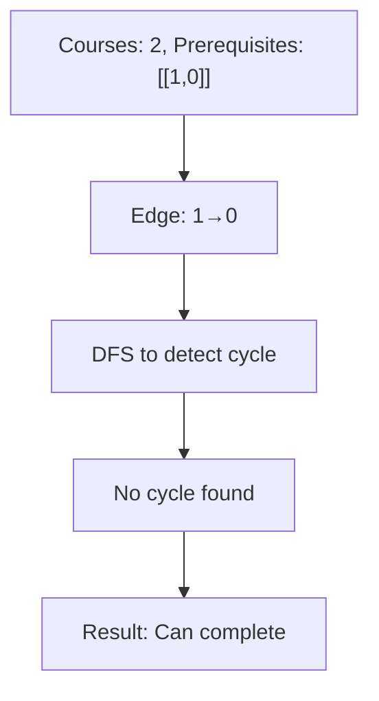
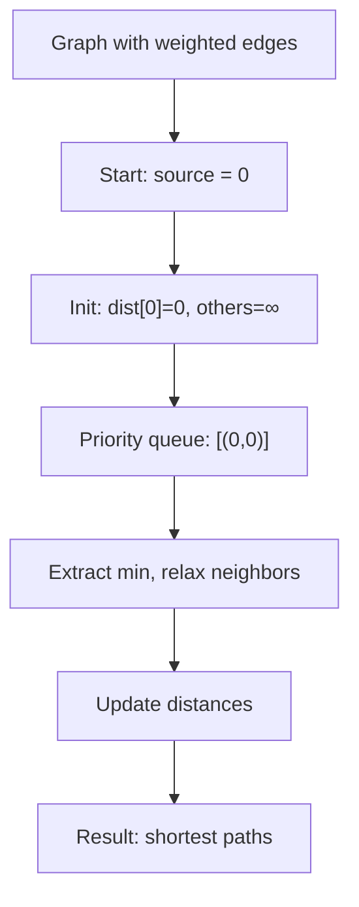
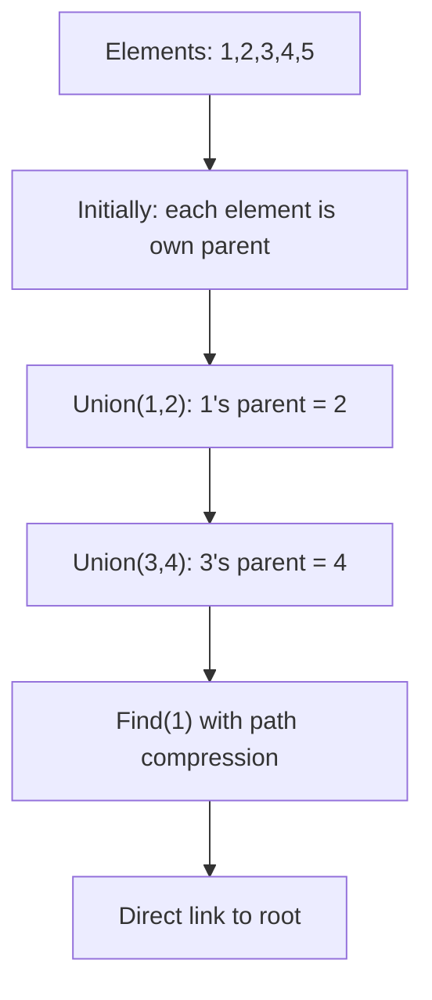
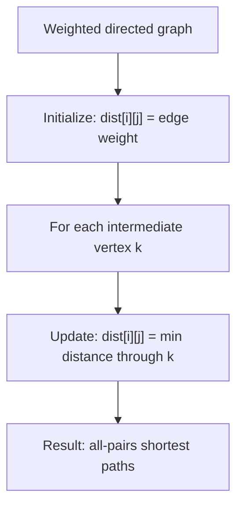
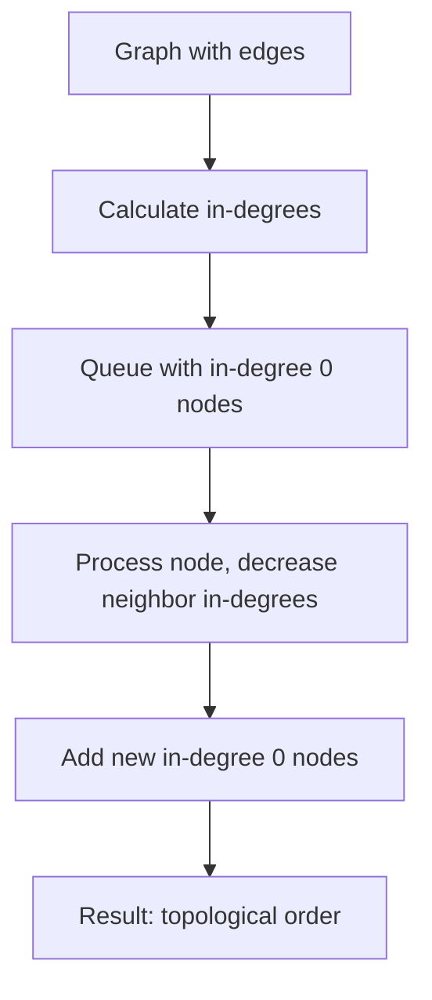
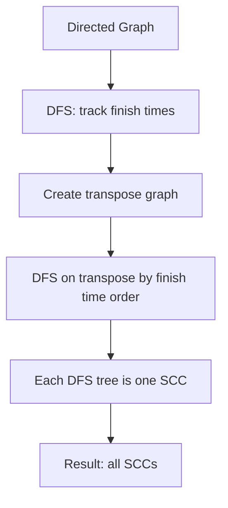
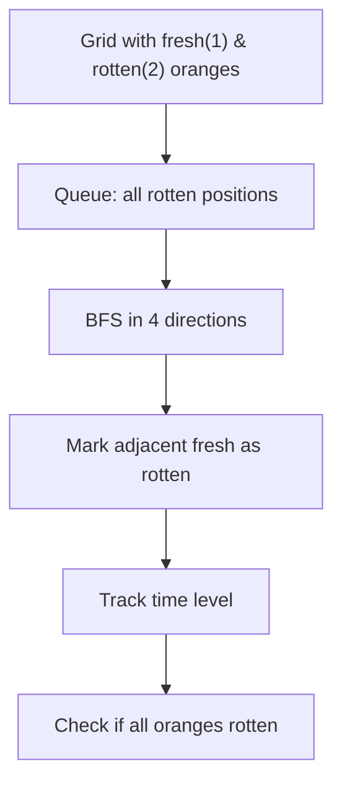

# Day 8: Graph Algorithms

## Overview
Graph traversals, shortest paths, topological sorting, and strongly connected components.

## Problems

### 1. **Alien Dictionary** - Topological Sort
**Description**: Derive order of characters in alien language from sorted words.

**Approach**: Build directed graph from character pairs, perform topological sort.

**Time Complexity**: O(n + k log k) where n=total chars, k=unique chars | **Space Complexity**: O(k)

---

### 2. **Bipartite Graph Check** - Graph Coloring
**Description**: Check if graph can be colored with 2 colors (bipartite check).

**Approach**: Use BFS/DFS to color nodes alternately, detect conflict.

**Time Complexity**: O(V + E) | **Space Complexity**: O(V)

---

### 3. **Cheapest Flights Within K Stops** - Modified Dijkstra
**Description**: Find cheapest flight from source to destination with at most k stops.

**Approach**: Use modified Dijkstra tracking (node, stops, cost).

**Time Complexity**: O((V+E) log V) | **Space Complexity**: O(V)

---

### 4. **Course Schedule** - Cycle Detection
**Description**: Determine if all courses can be completed with prerequisites (DAG check).

**Approach**: Build graph from prerequisites, detect cycle using DFS.

**Time Complexity**: O(V + E) | **Space Complexity**: O(V + E)

---

### 5. **Dijkstra's Algorithm** - Shortest Path
**Description**: Find shortest path from source to all nodes in weighted graph.

**Approach**: Use priority queue, repeatedly pick minimum distance node and relax edges.

**Time Complexity**: O((V+E) log V) with min-heap | **Space Complexity**: O(V)

---

### 6. **Disjoint Set Union (DSU)** - Union-Find
**Description**: Efficient data structure for union and find operations with path compression.

**Approach**: Maintain parent pointers with union by rank and path compression.

**Time Complexity**: O(α(n)) amortized per operation | **Space Complexity**: O(n)

---

### 7. **Floyd-Warshall Algorithm** - All Pairs Shortest Path
**Description**: Find shortest paths between all pairs of nodes.

**Approach**: Use DP with intermediate vertices - dist[i][j] = min(dist[i][j], dist[i][k] + dist[k][j]).

**Time Complexity**: O(V³) | **Space Complexity**: O(V²)

---

### 8. **Kahn's Algorithm** - Topological Sort
**Description**: Topological sort using in-degree (BFS approach).

**Approach**: Process nodes with in-degree 0, reduce in-degrees of neighbors.

**Time Complexity**: O(V + E) | **Space Complexity**: O(V)

---

### 9. **Kosaraju's Algorithm** - Strongly Connected Components
**Description**: Find all strongly connected components (SCCs) in directed graph.

**Approach**: DFS on original graph for finish times, DFS on transpose in order of decreasing finish times.

**Time Complexity**: O(V + E) | **Space Complexity**: O(V)

---

### 10. **Rotten Oranges** - Multi-source BFS
**Description**: Find minimum time for all fresh oranges to rot (BFS on grid).

**Approach**: Multi-source BFS starting from all rotten oranges simultaneously.

**Time Complexity**: O(m*n) | **Space Complexity**: O(m*n)
