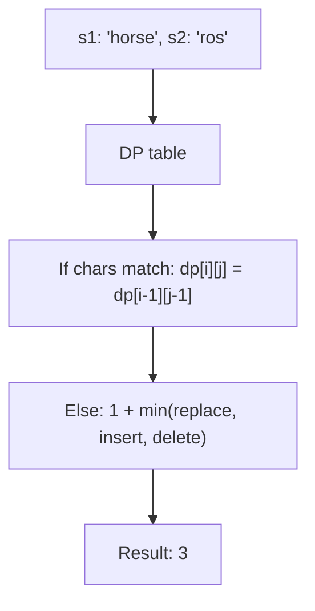
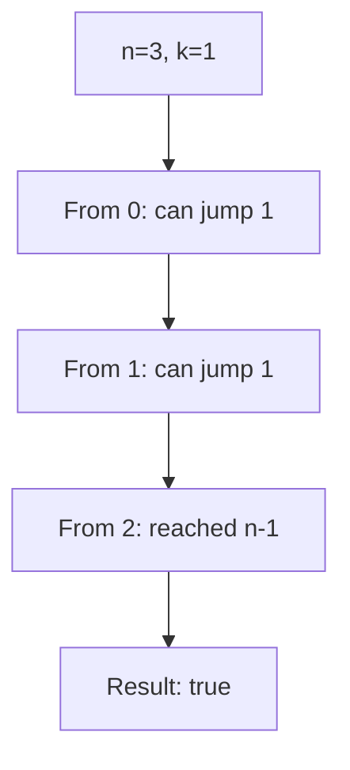
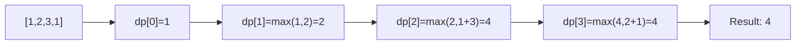
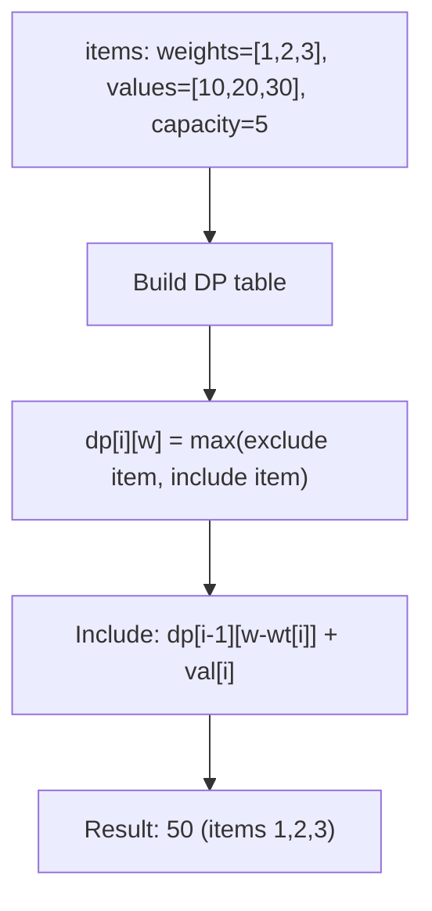
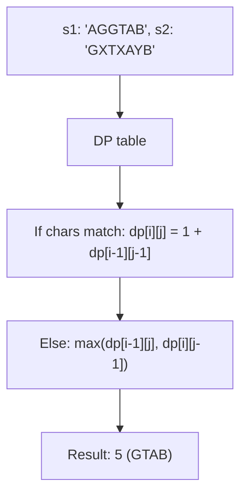
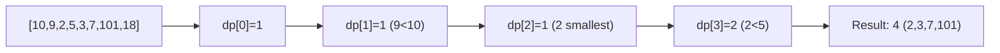
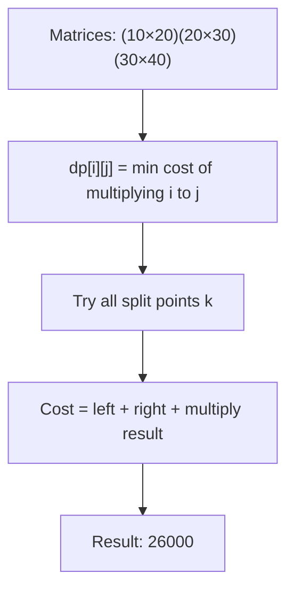
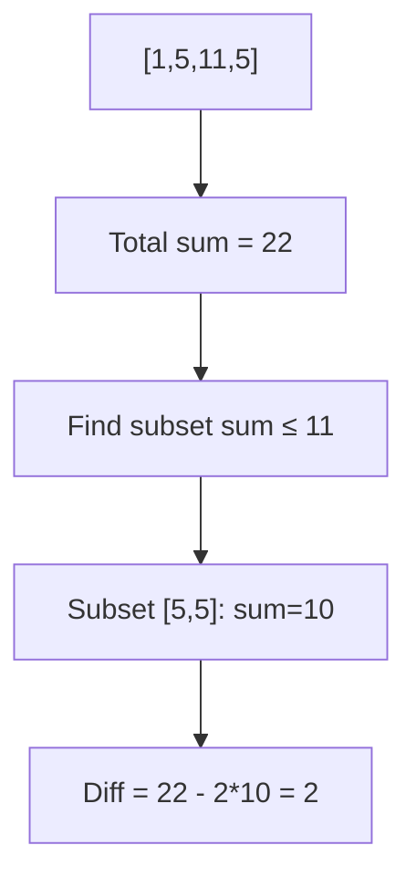
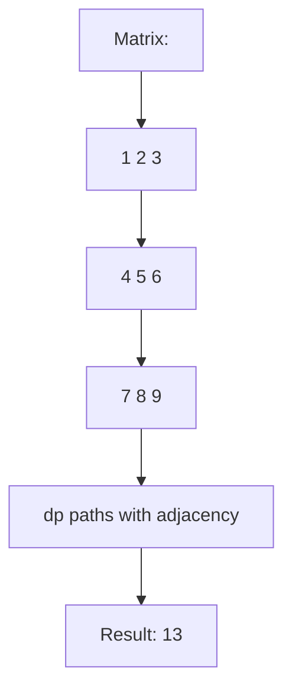
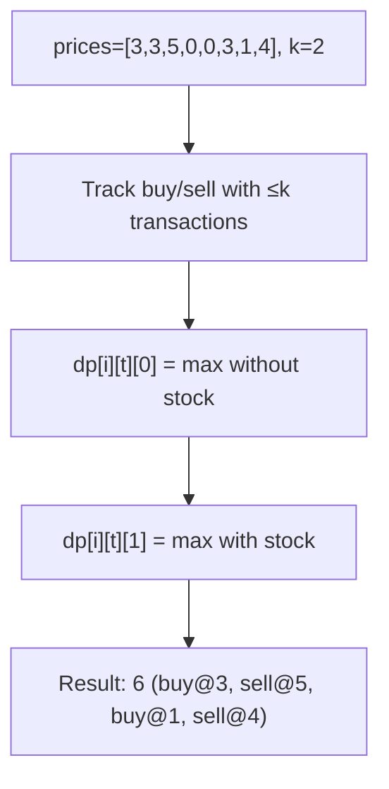

# Day 9: Dynamic Programming

## Overview
Advanced DP problems covering edit distance, knapsack, longest subsequences, and optimization problems.

## Problems

### 1. **Edit Distance** - DP Problem
**Description**: Minimum operations (insert, delete, replace) to transform one string to another.

**Approach**: DP table where dp[i][j] = min operations to transform first i characters to first j.

**Time Complexity**: O(m*n) | **Space Complexity**: O(m*n)

---

### 2. **Frog Jump with K Jumps** - DP
**Description**: Frog can jump 1 to k steps, reach from 0 to n-1.

**Approach**: DP where dp[i] = can frog reach position i.

**Time Complexity**: O(n*k) | **Space Complexity**: O(n)

---

### 3. **House Robber** - DP
**Description**: Maximum money can rob without robbing adjacent houses.

**Approach**: dp[i] = max(dp[i-1], dp[i-2] + arr[i]).

**Time Complexity**: O(n) | **Space Complexity**: O(n)

---

### 4. **0/1 Knapsack** - Classic DP
**Description**: Select items to maximize value within weight limit.

**Approach**: DP table where dp[i][w] = max value using first i items with weight w.

**Time Complexity**: O(n*W) where W=capacity | **Space Complexity**: O(n*W)

---

### 5. **Longest Common Subsequence (LCS)** - DP
**Description**: Find length of longest common subsequence between two strings.

**Approach**: DP table where dp[i][j] represents LCS of first i and j characters.

**Time Complexity**: O(m*n) | **Space Complexity**: O(m*n)

---

### 6. **Longest Increasing Subsequence (LIS)** - DP
**Description**: Find length of longest increasing subsequence.

**Approach**: dp[i] = length of LIS ending at i.

**Time Complexity**: O(n²) basic, O(n log n) optimized | **Space Complexity**: O(n)

---

### 7. **Matrix Chain Multiplication (MCM)** - DP
**Description**: Find optimal way to parenthesize matrix chain multiplication.

**Approach**: dp[i][j] = min operations to multiply matrices from i to j.

**Time Complexity**: O(n³) | **Space Complexity**: O(n²)

---

### 8. **Minimum Absolute Difference** - DP
**Description**: Partition array into two subsets with minimum difference sum.

**Approach**: Knapsack variant - find subset sum closest to total/2.

**Time Complexity**: O(n*sum) | **Space Complexity**: O(n*sum)

---

### 9. **Minimum Falling Path Sum** - 2D DP
**Description**: Find minimum path sum from top to bottom (each row pick one element).

**Approach**: dp[i][j] = min sum to reach [i][j] from top row.

**Time Complexity**: O(m*n) | **Space Complexity**: O(m*n)

---

### 10. **Stock Buy Sell IV** - Complex DP
**Description**: Complete at most k transactions to maximize profit.

**Approach**: DP with states (day, transactions_used, holding/not_holding).

**Time Complexity**: O(n*k) or O(n) if k ≥ n/2 | **Space Complexity**: O(n*k)
